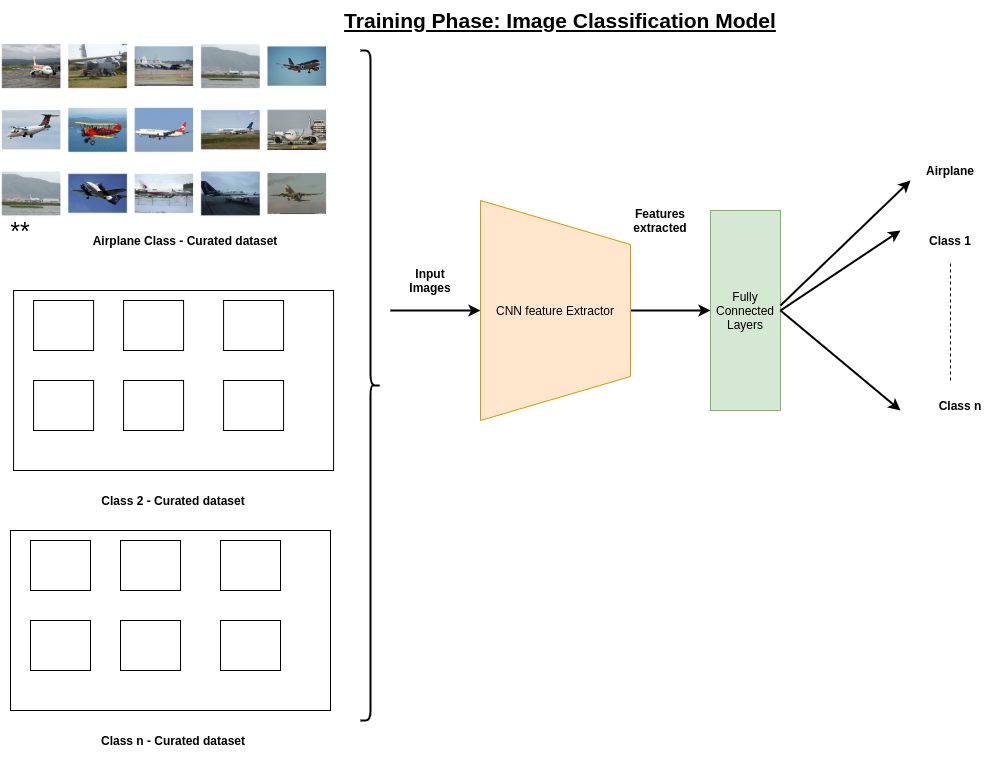
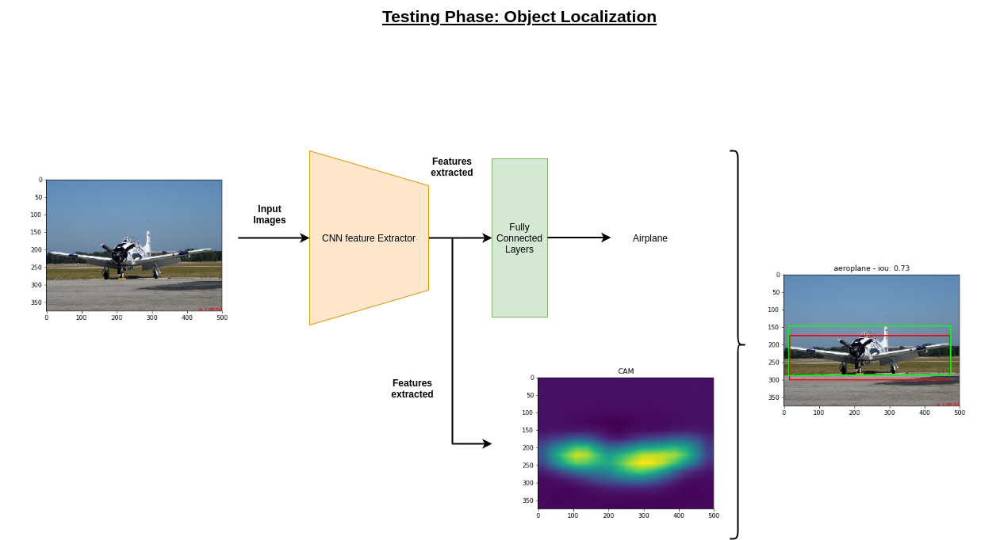
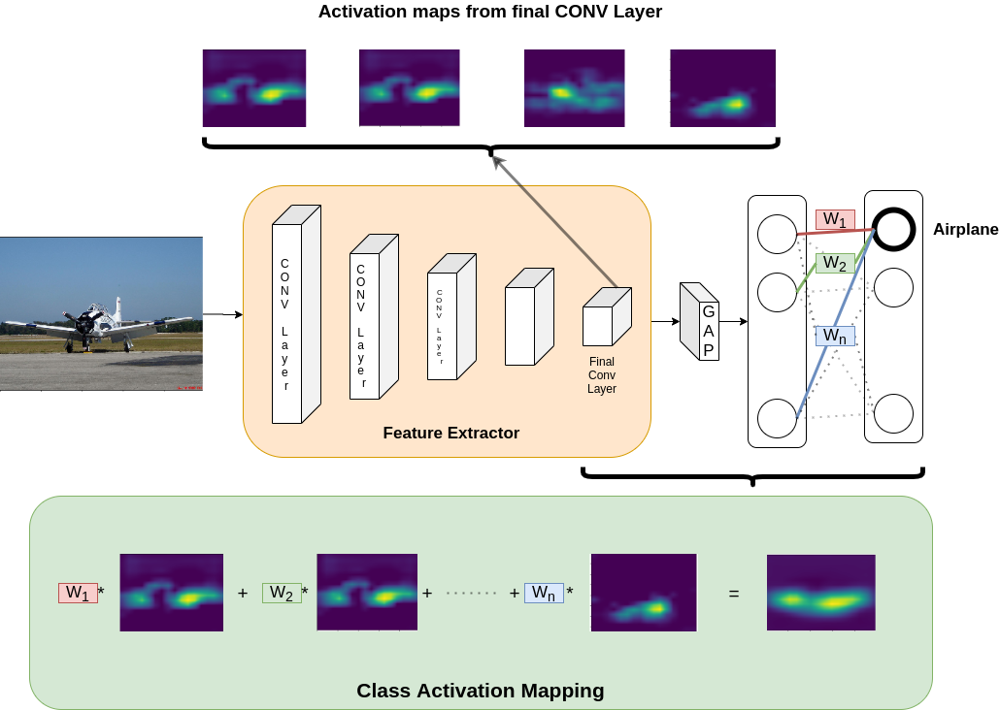
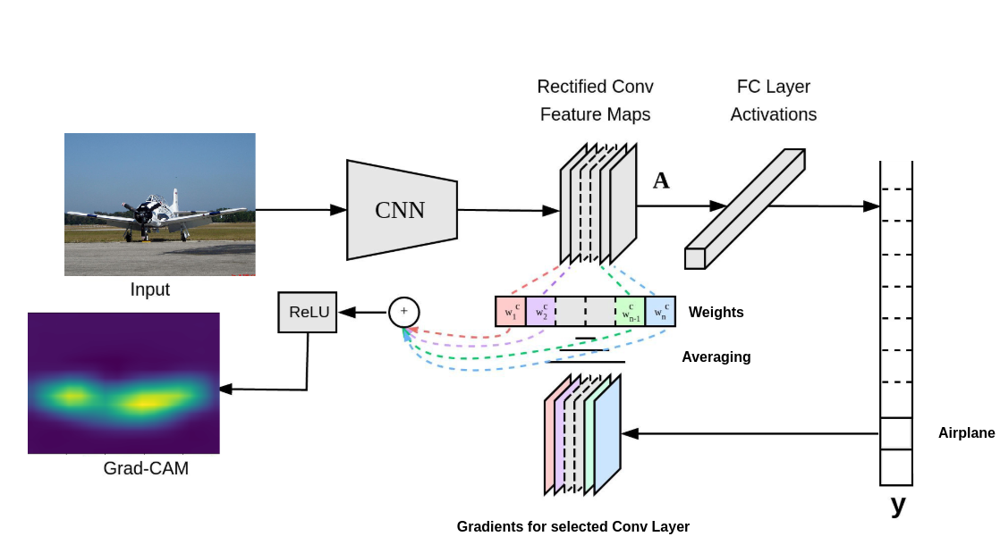

# Localization of Objects Using Unsupervised Representation Learning and Object Proposal Techniques 
[Report](Report%20and%20paper/MuthireddyVSSR-RnDReport.pdf), [Paper](Report%20and%20paper/WeaSuL_2021_ICLR_rejected.pdf) (WeaSUL 2021 ICLR - Rejected)

## Abstract
Weakly Supervised Object Localization (WSOL) uses classification models
trained only on image-level labels to localize objects. Although different WSOL
techniques have shown results in improving object localization performance under weak supervision, limited studies have analyzed the role of dataset distribution
on the performance of WSOL techniques. In this paper, we study the effects of
intra-class variance in the dataset using selected WSOL techniques. We argue that
intra-class variance is an important factor when applying WSOL techniques. We
observe from our experiments that 2 baseline methods have a drop in performance
when trained on datasets with limited intra-class variance. Furthermore, we show
that artificially augmenting the intra-class variance improves the localization performance.

## Training Phase
* Training a deep neural network as a classification model
* Only class level labels are available


## Testing Phase
* Trained classification model is used to localize objects
* Generate object level and pixel level labels during testing


## Class Activation Mapping (CAM)
* Class Activation Mapping: the confidence score of predicted class is projected back to the preceding
convolution layer to generate the class activation maps (CAMs)

## Grad-CAM
* Gradient Class Activation Mapping architecture. Grad-CAM uses gradient flow passing through last
convolutional layer to generate weights


## Research results
* Full report on research and results for various experiments are documented in [MuthireddyVSSR-RnDReport](Report%20and%20paper/MuthireddyVSSR-RnDReport.pdf)
* Plausible publication and unique selling point is in [paper](Report%20and%20paper/WeaSuL_2021_ICLR_rejected.pdf)
## Requirements
```
pip install -r requirements.txt
```
* Given in requirements file

## Dataset structure
* PASCAL VOC dataset
```
--root
---VOC2012
----Annotations
----ImageSets
----JPEGImages
----SegmentationClass
----SegmentationObject
```
* YCB dataset
```
--root
---train
----001_chips_can
-----masks
---- ....
----077_rubiks_cube
-----masks
---val
----001_chips_can
-----masks
---- ....
----077_rubiks_cube
-----masks
```
* RoboCup@Work dataset
```
--root
---images
----train
-----axis
----- ....
----- motor
----val
-----axis
----- ....
----- motor
```
### Training
```
python3 train.py --batch_size: BATCH SIZE (int),
                 --save_after: Save weights after every n epochs,
                 --num_epochs: number of epochs,
                 --dataset: Have option of three datsets VOC, YCB, at_work,
                 --dataset_path: Give the path to dataset,
                 --backbone: Have option of three backbones vgg16, resnet18, squeezenet1_1,
                 --experiment_number: Give unique identity to experiment
```

### Evaluation for classification metrics
```
python3 classification_eval.py --batch_size: BATCH SIZE (int),
                 	       --dataset: Have option of three datsets VOC, YCB, at_work ,
                               --dataset_path: Give the path to dataset,
                               --backbone: Have option of three backbones vgg16, resnet18, squeezenet1_1,
                               --checkpoint_path: Path for trained checkpoint
```

### Evaluation for localization metrics
Evaluation on localization metrics for different datasets is carried out differently due to very different structure of datasets.
* PASCAL VOC dataset
```
python3 localization_eval_VOC.py --wsol_method: select cam or gradCAM,
                               --dataset_path: Give the path to dataset,
                               --backbone: Have option of three backbones vgg16, resnet18, squeezenet1_1,
                               --checkpoint_path: Path for trained checkpoint
```
* YCB dataset
```
python3 localization_eval_YCB.py --wsol_method: select cam or gradCAM,
                               --dataset_path: Give the path to dataset,
                               --backbone: Have option of three backbones vgg16, resnet18, squeezenet1_1,
                               --checkpoint_path: Path for trained checkpoint,
                               --masks_path: Give the path to masks dataset
```
* RoboCup@Work dataset
```
python3 localization_eval_atwork.py --wsol_method: select cam or gradCAM,
                               --dataset_path: Give the path to dataset,
                               --backbone: Have option of three backbones vgg16, resnet18, squeezenet1_1,
                               --checkpoint_path: Path for trained checkpoint,
                               --masks_path: Give the path to masks dataset
```

#### Code base is adapted from following repositories
* https://github.com/clovaai/wsolevaluation
* https://github.com/jacobgil/pytorch-grad-cam


